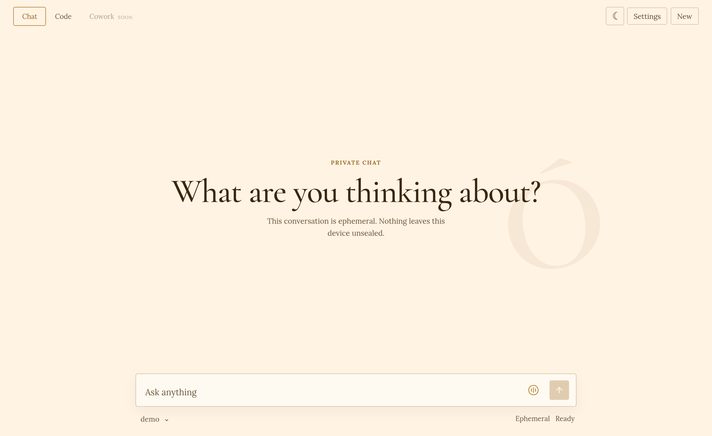
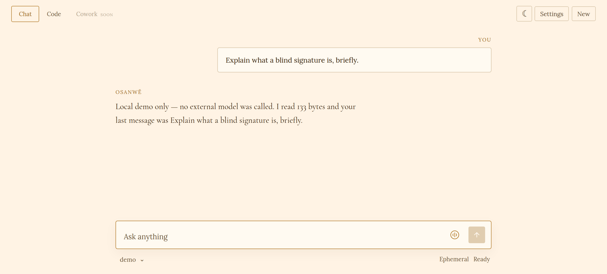
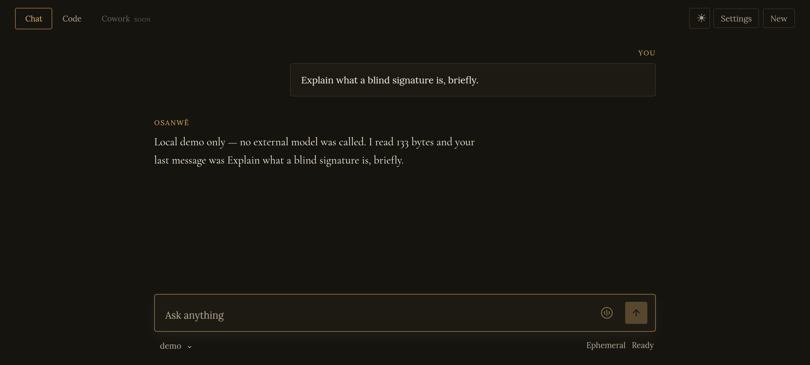
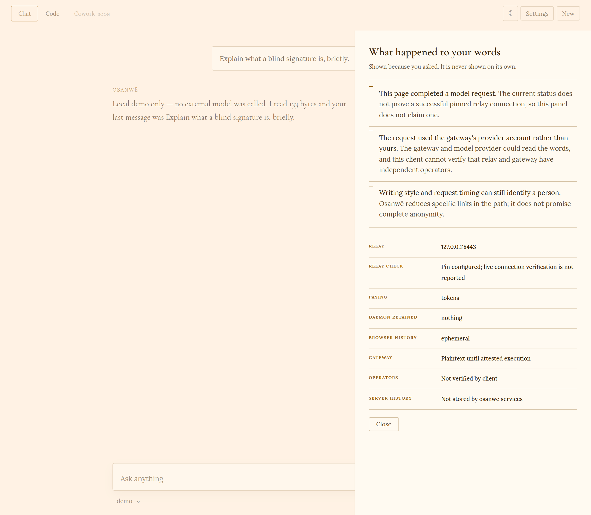
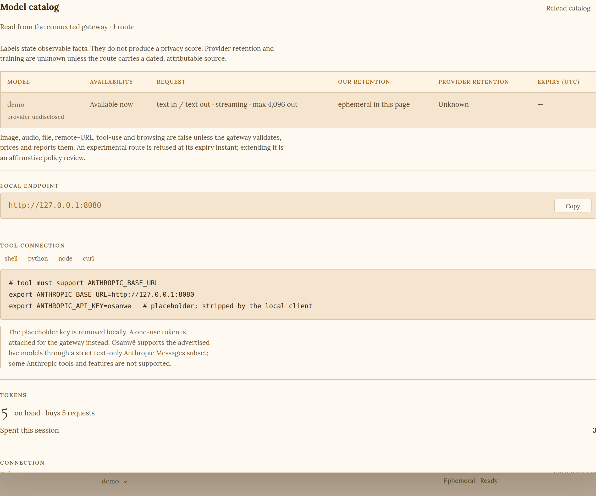

# Osanwë

**An encrypted relay for AI inference, and an experimental blind-signed token gateway.**

[Project website](https://ezrastone.github.io/Osanwe/) · [Technical beta charter](docs/beta.md) ·
[Current Phase 0 evidence](docs/phase0-results.md)

The runnable bring-your-own-key path is designed to keep prompts unreadable to a pinned relay and,
when that relay has a separate operator, to avoid directly giving the provider the user's source IP.
The provider still sees the user's own API account, prompt content and timing; no independently
operated public relay is enrolled today. The token path replaces that account credential with a
blind-signed token intended to prevent direct issuance-to-redemption matching, but it is pre-launch
software: there is no public network, timing and collusion remain, the gateway operator can read
prompts until attested execution is implemented, and production controls are still incomplete.

Start with the [quickstart](docs/quickstart.md), read [who runs what](docs/who-runs-what.md), and do
not expose the token gateway before following the warnings in the [deployment guide](docs/deploying.md).

The first beta is being prepared for ten invited testers. It is free, text-only, and limited to
synthetic or deliberately non-sensitive prompts. The public website is an explanation and download
front door, not a hosted chat service: invited archives open the app on the tester's own loopback
interface and keep relay secrets out of the website.

## What it looks like

Every image on this page is the real client, photographed from `./demo/ui.sh`. That script
starts a stand-in provider, a mint, a gateway, a relay and the client on one machine, generates
its own keys, and deletes them on Ctrl-C. The replies are canned and say so on their face; no
external model is called and no money moves.

| A completed exchange | The same, dark |
|---|---|
|  |  |

### What happened to your words

The disclosure panel opens only when asked for, and it is written to say what the client cannot
prove as readily as what it can. Here it declines to claim a verified relay connection, states
that the gateway could read the words, and volunteers that writing style and timing still
identify a person.

### The model catalog

Labels are read live from the connected gateway and state observable facts only. Provider
retention stays **Unknown** unless the route carries a dated, attributable source; the interface
never converts an unknown policy into a privacy score.

## Accountless local client

The bearer binary now embeds a dependency-free local web client with Chat and Code modes; the
model catalog and connection details live in Settings, as shown above. Chat sends genuine
multi-turn context, streams responses, and starts with ephemeral history.
People may explicitly save conversations in their browser's IndexedDB, restore them, export a
plaintext JSON copy, or delete them. No conversation-history endpoint exists on an Osanwë service.

The model catalog reads the connected gateway's live catalog and shows enforced text capabilities,
request limits, and factual privacy labels. Provider retention and training remain **unknown** unless
the gateway has sourced metadata; the interface does not turn unknown policy into a privacy score.

The first ten-person beta is free and does not use a payment path. The BTCPay adapter is disabled
pre-launch code for a possible later paid beta; it is designed so one settled invoice authorizes one
one-shot token. Card, Monero, cash, and voucher adapters remain product work, and no real-money beta
should precede an external review of interrupted and concurrent issuance.

See the [v0.1 scope](docs/product/v0.1-scope.md), [privacy boundaries](docs/product/privacy-boundaries.md),
and [payment notes](docs/payments.md) for what is and is not promised.

> In Tolkien's *Ósanwe-kenta*, *ósanwë* is the direct transmission of thought between minds. Its
> central doctrine is that a mind, open by nature, may close itself against intrusion and that no
> power can rightfully force it open. A prompt is a thought in transit. This network is the barrier.
