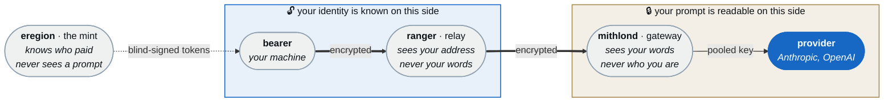
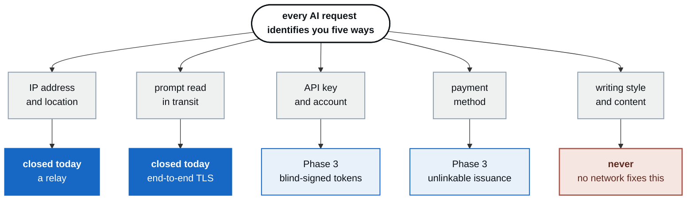

# Osanwë

**An anonymity network for AI inference.** Use frontier models without the provider being able to
link the prompt to a person and pool contributed hardware to serve open-weight models for those
who would rather trust no one at all.

> In Tolkien's *Ósanwe-kenta*, *ósanwë* is the direct transmission of thought between minds. Its
> central doctrine is that a mind, open by nature, may close itself against intrusion and that no
> power can rightfully force it open. A prompt is thought in transit. This network is the barrier.

---

## Documents

| | |
|---|---|
| **[Design &amp; threat model](docs/index.html)** | The full architecture, threat model and roadmap |
| [Abuse policy](docs/abuse-policy.md) | What we prohibit, what we can and cannot see, legal obligations |
| [ADR 0001 — BYOK first](docs/decisions/0001-byok-first.md) | The Terms of Service posture, decided |
| **[Quickstart](docs/quickstart.md)** | Run a relay and a client — Phase 2 is working code |
| [The directory](docs/directory.md) | Relay discovery, and the trust trade it makes |
| [Phase 0 results](docs/phase0-results.md) | The gating latency measurement — **not yet run** |
| [Phase 0 tooling](tools/README.md) | Harness and throwaway relay, ready to run |

GitHub displays `.html` files as source rather than rendering them. To read it properly, either:

- enable **GitHub Pages** on this repository with source *Deploy from a branch* → `/docs`, or
- clone and open `docs/index.html` in a browser, or
- view it through <https://htmlpreview.github.io/>.

---

## The one-paragraph version

The original idea — contribute DGX Sparks to a Tor-like network and get anonymity with frontier
models — contains two different systems fused into one sentence. Frontier models are closed-weight,
so donated hardware can never run them; in that path a node only forwards bytes. Separating the
two is the design document's main contribution:

| | **System A — the relay** (`osanwe`) | **System B — the compute market** (`erebor`) |
|---|---|---|
| Models | Frontier, closed | Open-weight |
| A node | Forwards encrypted bytes | Executes model layers |
| Hardware | A cheap VPS | The DGX Spark, genuinely |
| Hard problem | Anonymous *authorization* | WAN latency, work verification |
| Field state | **Open** | **Crowded** |

Build **System A first**. And note that routing is the easy half: onion routing hides your IP, but
the request still carries an API key bound to a credit card bound to your name. The real problem is
anonymous authorization, solved with blind signatures rather than circuits.

## Architecture at a glance

Three parties, split so that no single one holds both halves of your identity.



**Identity stops at the relay. Content starts at the gateway. Nothing sits on both sides.**

Security rests on the mint, relay and gateway **not colluding**, the same assumption Apple's
Private Relay makes. It is stated plainly here rather than buried, because a privacy claim whose
assumptions are concealed is a lie with extra steps.

### What is actually built today

Phase 2 is the left half of that picture. `eregion` and `mithlond` are Phase 3 and do not exist
yet, so today the client reaches the provider through the relay using your own API key:

```mermaid
flowchart LR
    T(["your tool<br/><i>SDK, editor, agent</i>"])
    B(["<b>bearer</b><br/>127.0.0.1:8080"])
    R(["<b>ranger</b><br/><i>a VPS elsewhere</i>"])
    P(["<b>provider</b><br/>api.anthropic.com"])

    T -- "plain HTTP<br/><i>never leaves your machine</i>" --> B
    B == "TLS #1 · hides which provider you use" ==> R
    R == "TLS #2 · the relay holds no key for this" ==> P

    classDef local fill:#eff1f1,stroke:#8fa0b0,stroke-width:1.5px,color:#0d1217
    classDef hop   fill:#e8f0f9,stroke:#1668c4,stroke-width:2px,color:#0d1217
    classDef far   fill:#1668c4,stroke:#1668c4,stroke-width:2px,color:#ffffff
    class T,B local
    class R hop
    class P far
```



Two encryption layers, protecting different things. **TLS #2** runs end to end from `bearer` to the
provider, so the relay carries ciphertext it has no key for. **TLS #1** wraps that, because a
`CONNECT` request names its destination in the clear, and without it anyone watching your uplink
would read `CONNECT api.anthropic.com:443` and learn exactly which provider you use.

### Where identity actually leaks

Routing closes one channel out of five. Being honest about the other four is the point:



## Components

| Component | Role |
|---|---|
| `bearer` | Client SDK / CLI. Holds tokens, verifies gateway attestation |
| `eregion` | Token mint. Blind-signed issuance; learns billing identity and nothing else |
| `ranger` | Relay node. Sees client IP, never plaintext |
| `mithlond` | Exit gateway. Runs in an attested TEE; sees content, never identity |
| `council` | Directory authority. Signed node descriptors and consensus |
| `erebor` | Compute market for open-weight models (Phase 4) |

## What this does *not* protect against

Stated up front, deliberately:

- **Self-deanonymization through prompt content or writing style.** Unfixable at the network layer.
  Paste your codebase and no number of hops will save you.
- A **global passive adversary** performing end-to-end timing correlation. That needs a mixnet,
  which is incompatible with token streaming.
- **Collusion** between relay and gateway against a targeted user.
- Compromise of your own device.
- **Evading provider safety systems** — a non-goal by intent, not by limitation. Osanwë provides
  anonymity from identity linkage, not freedom from model safety policy.

## Decisions taken

- **Terms of Service posture: bring-your-own-key first** ([ADR 0001](docs/decisions/0001-byok-first.md)).
  v1 relays the user's own API key over end-to-end TLS, so no node sees plaintext and no provider
  terms are violated. Pooled-key anonymity waits for Phase 3 and a cooperative conversation with
  providers. v1 marketing must describe what BYOK actually delivers — IP and location unlinkability
  — without implying the provider cannot identify the account.
- **Abuse posture: the line holds** ([abuse policy](docs/abuse-policy.md)). Anonymity from identity
  linkage, explicitly not freedom from model safety policy. No content logging, no backdoors, no
  client-side scanning; anonymous rate limiting, mint-level refusal, and provider safety systems
  left fully intact.

## Status

**Phase 2 is implemented and tested.** `bearer` (client) and `ranger` (relay) work end to end,
bring-your-own-key, with no third-party dependencies.

### See it work, right now

```bash
./demo/run.sh
```

Runs the whole network on one machine with no API key, no VPS and no accounts: a
relay, a directory authority, a client, and a stand-in provider. It publishes a
signed descriptor, gets refused (submission is default-deny), gets admitted,
fetches a signed consensus, selects a relay, sends a request, streams a
response, and then greps every byte the relay carried to show the conversation
was never readable.

### Or run it for real

```bash
make build

# on a VPS elsewhere
export OSANWE_RANGER_SECRET=$(ranger -gen-secret)
ranger -allow api.anthropic.com          # prints a pin

# on your machine
export OSANWE_SECRET='<that secret>'
bearer -relay relay.example:8443 -pin sha256/...
export ANTHROPIC_BASE_URL=http://127.0.0.1:8080
```

See the **[quickstart](docs/quickstart.md)** for the full walkthrough.

What that delivers today: the provider no longer learns your IP or location, and no relay operator
can read your prompts. What it does not deliver: the provider still knows which account is asking,
because the key is yours. Unlinking the account needs `eregion` and `mithlond`, which are Phase 3
and not built.

The relay-blindness claim is verified rather than asserted — `internal/integration` captures every
byte crossing the relay and fails if a prompt, an API key or a response can be recovered from it,
with a control that fails the test if the capture is not of encrypted traffic.

Relay discovery is also implemented: relays publish signed descriptors, authorities publish a
threshold-signed consensus, and clients select from it. Manual pinning stays supported and is never
silently overridden — see [the directory](docs/directory.md) for what that trade costs.

**Still outstanding: [Phase 0](docs/phase0-results.md).** The latency measurement has tooling but
has not been run, and it is the number that decides whether this is an interactive product or a
batch one.

| | |
|---|---|
| `cmd/ranger` · `internal/ranger` | Relay: TLS listener, default-deny allowlist, no content logging |
| `cmd/bearer` · `internal/bearer` | Client: loopback-only, streaming-preserving reverse proxy |
| `cmd/council` · `internal/directory` | Directory: signed descriptors, M-of-N consensus, relay selection |
| `internal/tunnel` | Pinned CONNECT dialer |
| `internal/certs` | Relay identity, pinned by public key |
| `internal/policy` · `internal/auth` | Destination allowlist, shared-secret auth |
| `tools/` | Phase 0 measurement harness (Python) |

See [§13 Build phases](docs/index.html) for the full roadmap.
